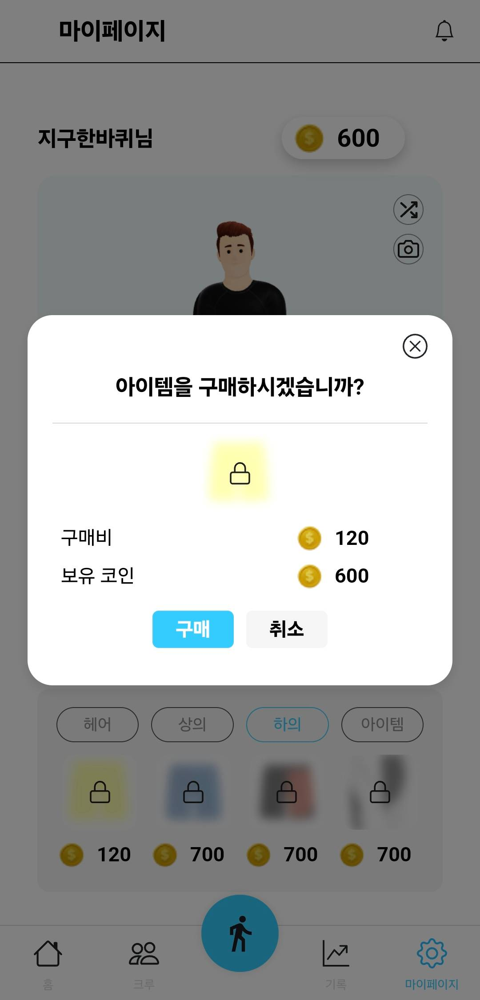
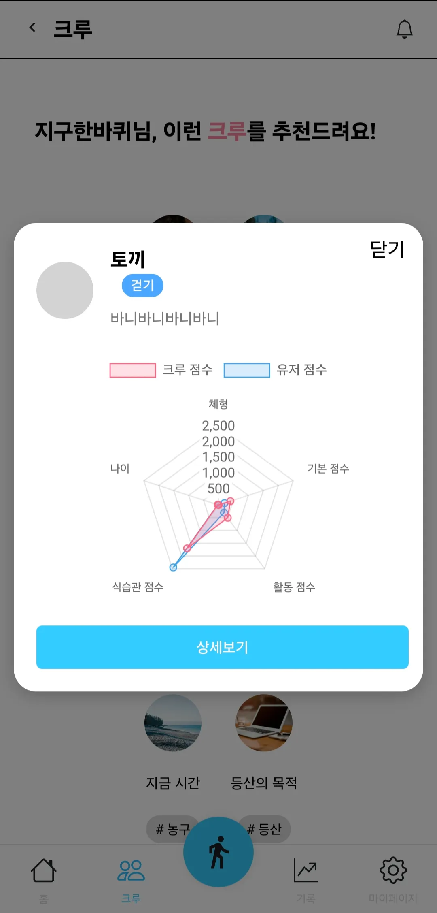

# 시연 시나리오
## 시연 순서
1. 로그인: 카카오(설문조사 생략)

|로그인|
|:---:|
||

2. 메인: 화면 설명
    - 로그인을 하게 되면, 체형과 식습관, 선호하는 운동을 통해 본인만의 캐릭터가 생성되는데, 이 캐릭터와 함께 변화하는 모습을 볼 수 있습니다.
    - 상단에 퀘스트와 출석 버튼이 있는데요, 달력 모양의 버튼을 누르면 출석을 할 수 있습니다.
    - 초록색 점이 찍힌 날짜는 일일 운동 기록 또한 볼 수 있습니다.

|메인|캘린더|퀘스트|
|:---:|:---:|:---:|
||||

3. 마이 페이지
    - 커스텀에서 아이템을 눌러 구매하게 되면, 캐릭터에 착용이 가능합니다.
    - 셔플 버튼을 눌러 다양한 모션을 볼 수 있고, 카메라 버튼을 눌러 스냅샷을 남길 수 있습니다.

|마이 페이지|파츠 구입|스냅샷|
|:---:|:---:|:---:|
||||

4. 운동: 운동 추천, 운동 기록(달리기)
    - 운동을 하기 전에 운동 추천 버튼을 통해 **추천 종목**을 먼저 살펴보겠습니다.
    - 그럼 운동 종목을 선택해 **달리기**를 해볼까요?
    - 버튼을 통해 시작, 중지, 종료를 할 수 있으며, 종료되었을 때 해당 운동 종목에 따른 칼로리가 계산되어 저장됩니다.

|운동 선택|운동 추천|운동 화면|
|:---:|:---:|:---:|
||||
5. 기록: 추가 정보 입력, 상세 정보 조회
    - 앞서 기록된 데이터를 기반으로 현재 패턴의 운동을 지속했을 때의 변화된 모습을 확인할 수 있으며, 이 운동 강도를 조금 더 높였을 때 예상되는 변화도 함께 확인해 보겠습니다.

|체형 예측|추가 예측|추가 예측 결과|
|:---:|:---:|:---:|
||||
    - 상세 보기를 통해 체형 기록을 자세히 확인할 수 있으며, 그래프를 선택하면 각 변수에 따른 변화 추이를 볼 수 있습니다.
    - 체형 입력 버튼을 통해 변화한 체형 및 식습관 설문조사를 하여 변경된 캐릭터를 만나 볼 수 있습니다.

|체형 기록|상세 기록|체형 입력|
|:---:|:---:|:---:|
||||

6. 크루: 크루 상세 조회, 크루 내 랭킹, 상대방 프로필, 모금하기, 배틀하기
    - 크루 메인 페이지에는 내 크루와 내 크루 중 배틀하고 있는 크루를 볼 수 있는데요,
    - 크루 배틀에 입장하면 배틀 중인 크루를 볼 수 있으며, 크루원의 이미지를 누르면 상대방 프로필로 이동합니다.

|크루 화면|배틀 조회|상대 프로필|
|:---:|:---:|:---:|
||||
    - 실시간 크루 랭킹을 통해 운동 종목에 따른 실시간 크루 랭킹을 확인 할 수 있습니다.
    - 생성 버튼을 통해 크루를 생성할 수 있고, 크루 추천 버튼을 통해 9개의 크루를 추천 받을 수 있습니다.

|크루 랭킹|크루 추천|추천 크루 정보|
|:---:|:---:|:---:|
||||

7. 알림
    - 퀘스트를 달성하거나 크루의 배틀이 시작, 끝났을 때 알림이 오며, 해당 페이지로 이동할 수 있습니다.